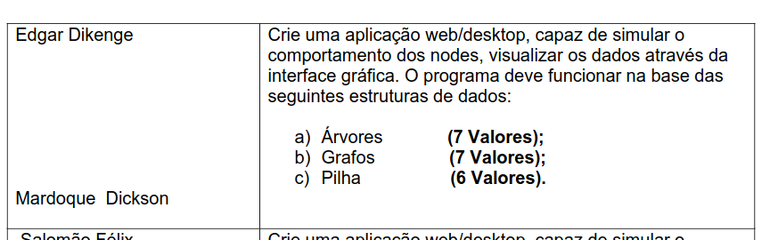

# Data Structures and Algorithms

## Overview

This project is a web/desktop application designed to simulate the behavior of nodes and visualize data structures through a graphical user interface (GUI). The application supports the following data structures:

> [Trees](https://www.w3schools.com/dsa/dsa_theory_trees.php)

> [Graphs](https://www.w3schools.com/dsa/dsa_theory_graphs.php)

> [Stacks](https://www.w3schools.com/dsa/dsa_data_stacks.php)

## Project Requirements

## Each data structure will handle a specific number of values:

    Trees: 7 values

    Graphs: 7 values

    Stacks: 6 values

## Project Structure

    Trees: Implementation of tree data structures with operations such as insertion, deletion, and traversal.

    Graphs: Implementation of graph data structures with operations such as adding/removing nodes and edges, as well as graph traversal algorithms.

    Stacks: Implementation of stack data structures with operations such as push, pop, and peek.

## Contributors

[Edgar Dikenge](https://github.com/edgar3g)

[Mardoque Dickson](https://github.com/mardoqueudickson1)
